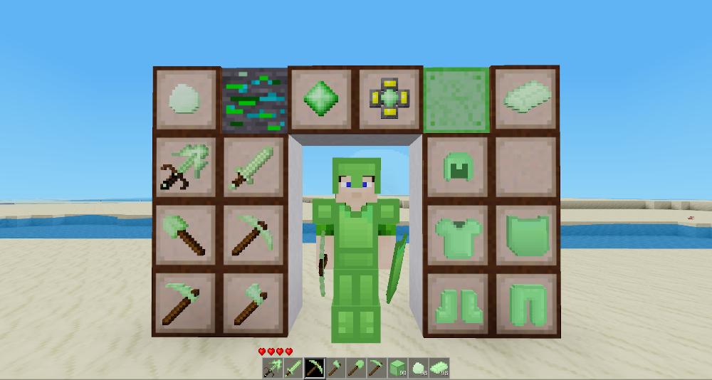

# Uranium Stuff
Mod for Minetest, adds Uranium tools and armor, compatible with technic.

Have you ever wondered what to do with your waste 0% uranium?  
Worry no more! Now you can use it to make tools and armor.  
Tools are fast and deal a lot of damage, armor also provides radiation protection.  

If the technic mod is not present, this mod will provide uranium ore generation.  
Uranium ore will be found at the same heights as with technic, but at much lower quantities,  
to compensate for the lack of need for centrifuging.  

Tools added:
 - Uranium Sword
 - Uranium Axe
 - Uranium Shovel
 - Uranium Pickaxe
 - Uranium Hoe
 - Uranium Multitool
    
Armor added:
 - Uranium Chestplate
 - Uranium Leggings
 - Uranium Boots
 - Uranium Helmet
 - Uranium Shield

